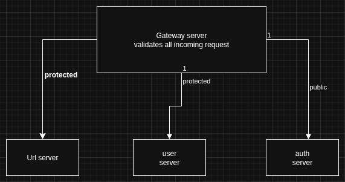

#  ShortLink
A microservice architecture built with java spring boot and golang chi framework. It is made up of
1.  Discovery server (Eureka java): for server discovery and availability.
2.  Gateway server(java): as central entry point in a microservices' system also for auth (jwt) protected path/servers
3.  Auth server(golang): for login,reset password, and resister new user.
4.  User server(golang): for user crud activities

##  Database
Postgres: User related db operations in user auth and gateway servers.\
Mongo: for url server

## Cashing
Redis: used in url server for url cashing

## Auth diagram

